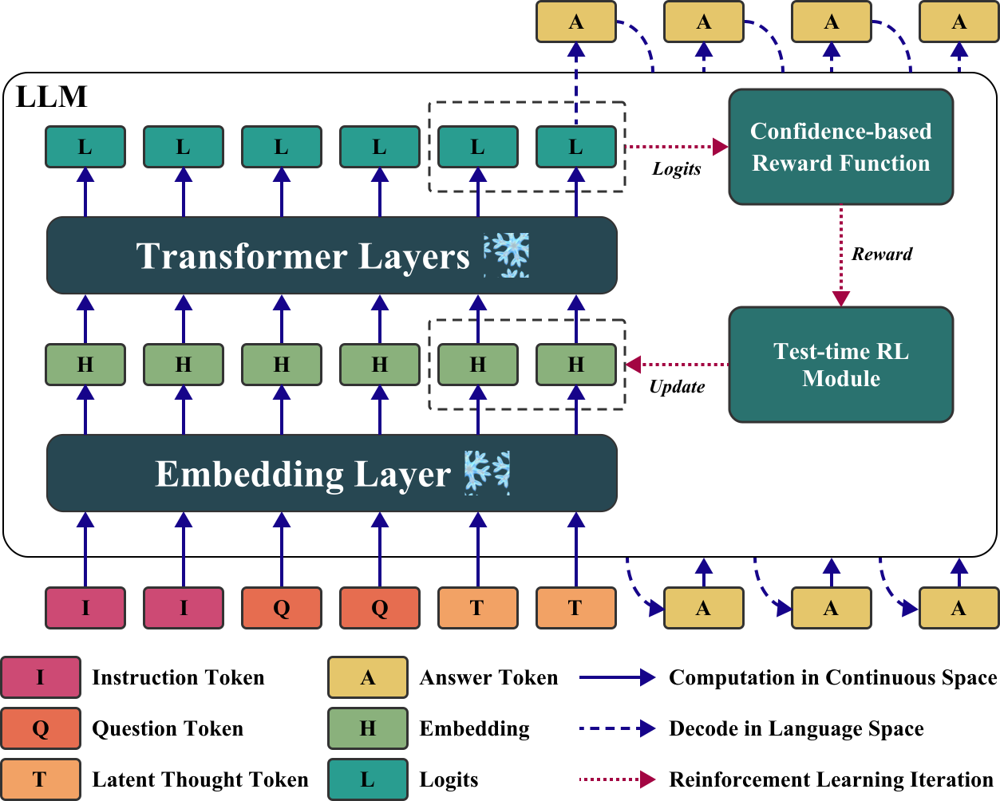

<div align="center">
  <h1>Thinking on the Fly: Test-Time Reasoning Enhancement via Latent Thought Policy Optimization</h1> 
</div>

<p align="center">
  <a href="https://arxiv.org/abs/2510.04182">
    
  </a>
</p>

## Overview

Latent Thought Policy Optimization (LTPO) is a parameter-free framework that enhances Large Language Model (LLM) reasoning entirely at test time by treating intermediate "thought" vectors as dynamic parameters rather than fixed representations . Instead of updating model weights, LTPO iteratively refines these latent vectors for each specific problem instance using an online policy gradient method guided by an intrinsic, confidence-based reward derived directly from the frozen model's own output distributions . This approach eliminates the need for external supervision or expensive text decoding during the optimization loop, enabling robust performance on challenging, out-of-distribution tasks like the AIME benchmarks where traditional latent reasoning methods often fail .



## Quick Start

### Install Dependencies

```bash
conda create -n ltpo python=3.10 -y
conda activate ltpo
bash install.sh
```

For the current local Windows setup used in smoke tests, the verified environment is:

```powershell
conda activate sc-likelihood-ratios
```

### Evaluate LTPO

Following command will evaluate LTPO on AIME2024 benchmark using Qwen2.5-7B-Instruct by default. To evaluate different models against other benchmarks, please change the corresponding arguments.

```bash
bash scripts/run_ltpo.sh
```

The detailed responses generated by the LLM are stored in `output/logistics.pt`.

### Run 7B Memory Pipeline

The one-command memory path is:

1. `build_memory`
2. `build_prototypes`
3. `memory_ltpo`

PowerShell:

```powershell
powershell -ExecutionPolicy Bypass -File .\scripts\run_memory_pipeline_7b.ps1
```

Bash:

```bash
bash scripts/run_memory_pipeline_7b.sh
```

By default these scripts use `Qwen/Qwen2.5-7B-Instruct`, download it into `./artifacts/models/Qwen2.5-7B-Instruct` if missing, run with the `sc-likelihood-ratios` conda environment, and write memory/prototype/eval outputs under `./output`. Use `-OutputDir` in PowerShell or `OUTPUT_DIR=...` in Bash to redirect test runs. Use `-SkipDownload` in PowerShell or `SKIP_DOWNLOAD=1` in Bash when the model is already available or when you want Transformers to use its normal cache.

### Evaluate Zero-Shot CoT Baseline

Following command will evaluate Zero-Shot CoT baseline against all five reasoning benchmarks.

```bash
bash scripts/batch_baselines_cot.sh
```

The output logs are located in `logs` directory, prefixed with `Baseline-CoT`.

The detailed responses generated by the LLM are stored in `output/logistics.pt`.

### Evaluate Zero-Shot CoT-Unk Baseline

Following command will evaluate Zero-Shot CoT-Unk baseline against all five reasoning benchmarks.

```bash
bash scripts/batch_baselines_cot_unk.sh
```

The output logs are located in `logs` directory, prefixed with `Baseline-CoT-Unk`.

The detailed responses generated by the LLM are stored in `output/logistics.pt`.

## Acknowledgement

Our work is inspired by [LatentSeek](https://github.com/bigai-nlco/LatentSeek)
and [SoftCoT](https://github.com/xuyige/SoftCoT). Thanks for their great work!

## Citation

If you find this work helpful, please cite:

```
@inproceedings{ye2026ltpo,
  title={Thinking on the Fly: Test-Time Reasoning Enhancement via Latent Thought Policy Optimization},
  author={Wengao Ye and Yan Liang and Lianlei Shan},
  booktitle={International Conference on Learning Representations},
  year={2026},
  url={https://openreview.net/forum?id=r1WEQzkCQv}
}
```
